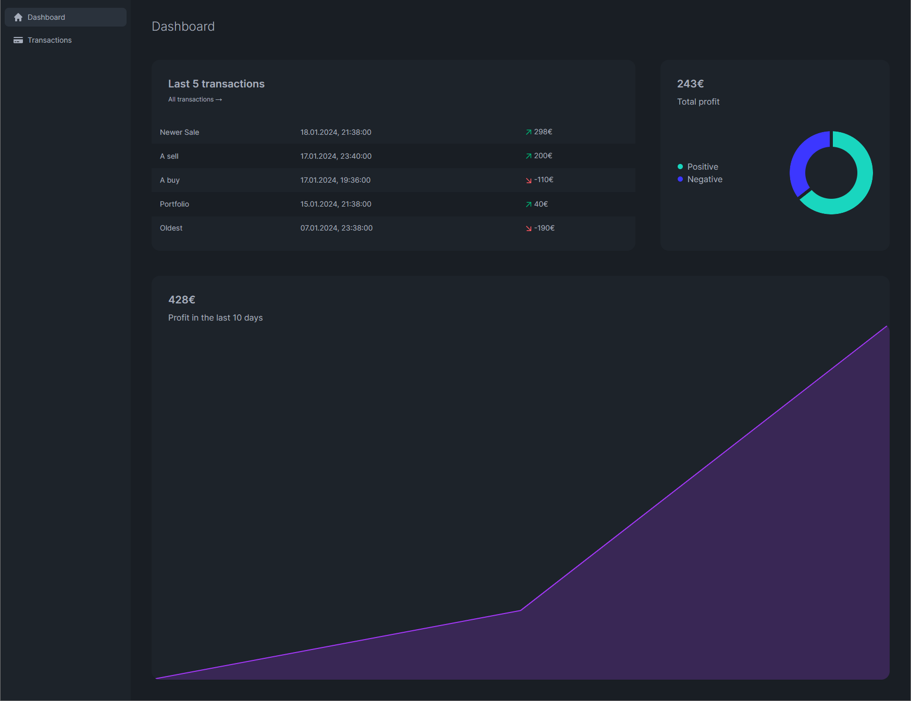
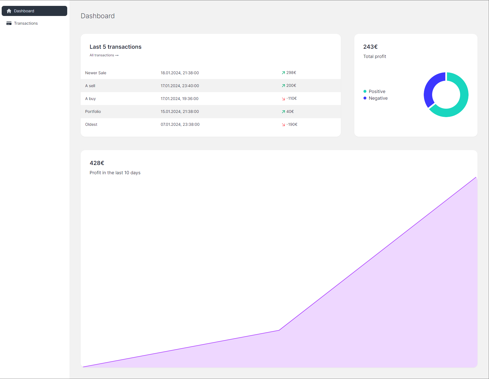
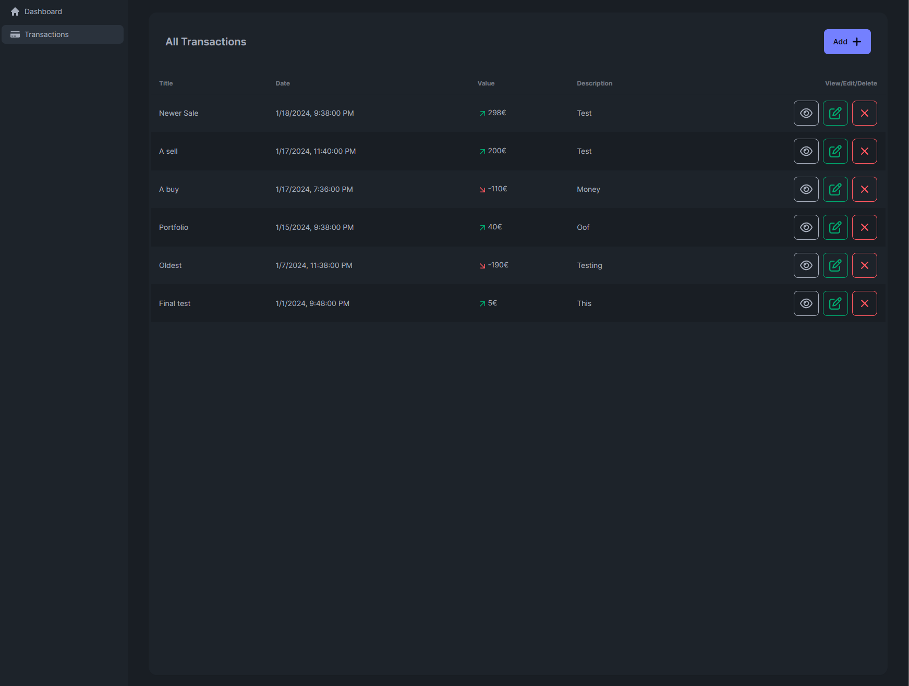
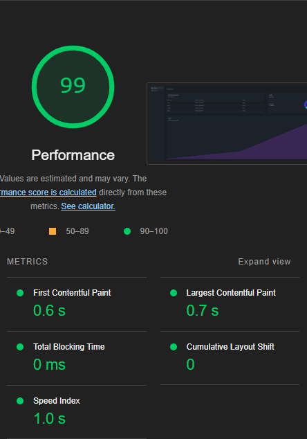

# Poolder Case

> A simple transaction dashboard using Next.js and Supabase.
> Currently at https://poolder.vercel.app/dashboard





## Table of Contents

- [Setup](#setup)
- [Usage](#usage)
- [Metrics](#metrics)

## Setup

First, make sure your `.env` file is set up with the following variables:

```sh
NEXT_PUBLIC_SUPABASE_URL=
NEXT_PUBLIC_SUPABASE_ANON_KEY=
```

Then set up your Supabase project with the following table ( OPEN SQL EDITOR ):

```sql
CREATE TABLE public."Transactions" (
    id uuid not null default gen_random_uuid (),
    created_at timestamp with time zone not null default now(),
    title character varying not null,
    description text not null,
    value bigint not null,
    constraint Transactions_pkey primary key (id)
  ) tablespace pg_default;
```

See [Supabase](https://supabase.io/) for more information. Note that you will also need to set up RSL to allow the app to connect, or disable it in the Supabase dashboard.

Then, run the following commands to start the application:

```sh
npm install
npm run build
npm run start
```

## Usage

The application will be available at [http://localhost:3000](http://localhost:3000).

You can add transactions by clicking the "Add Transaction" button and filling out the form.


## Metrics

Performance metrics by google show a 99% overall performance score.


